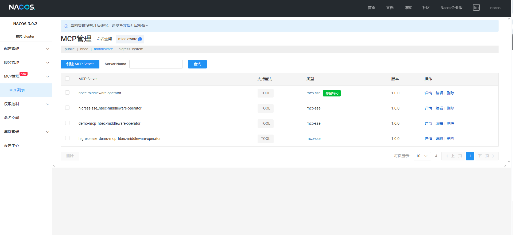
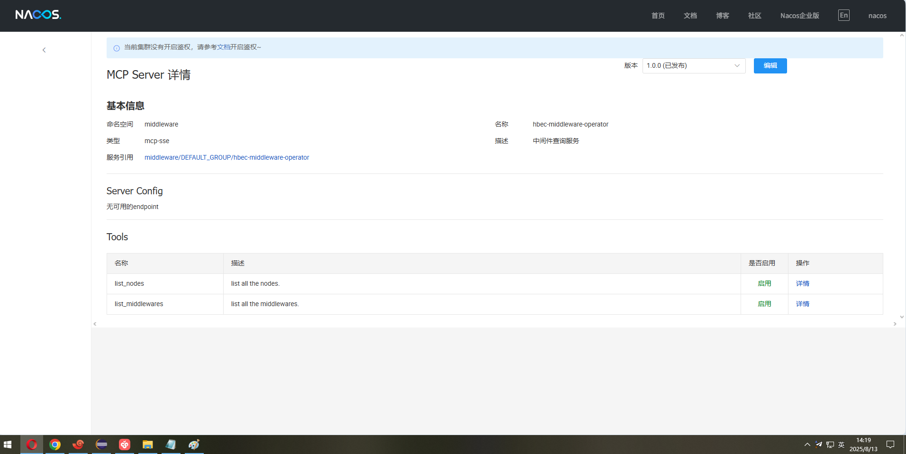
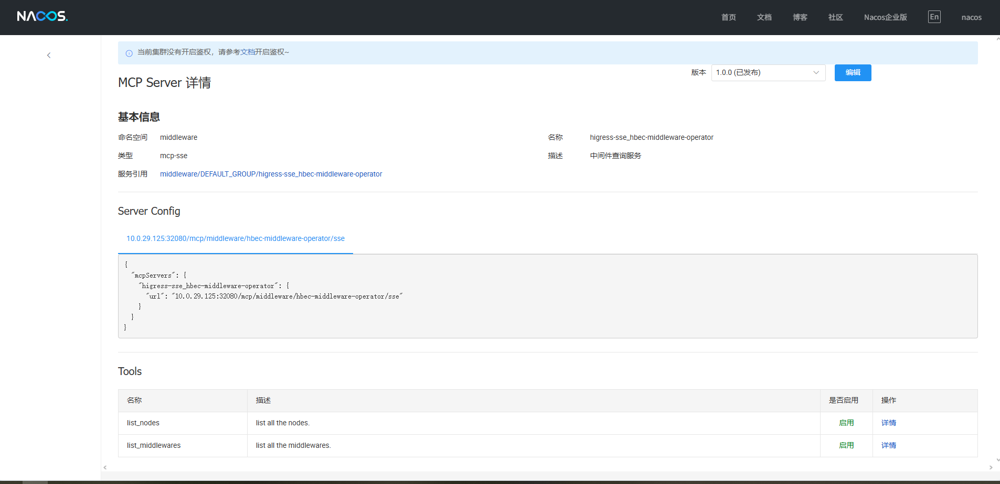
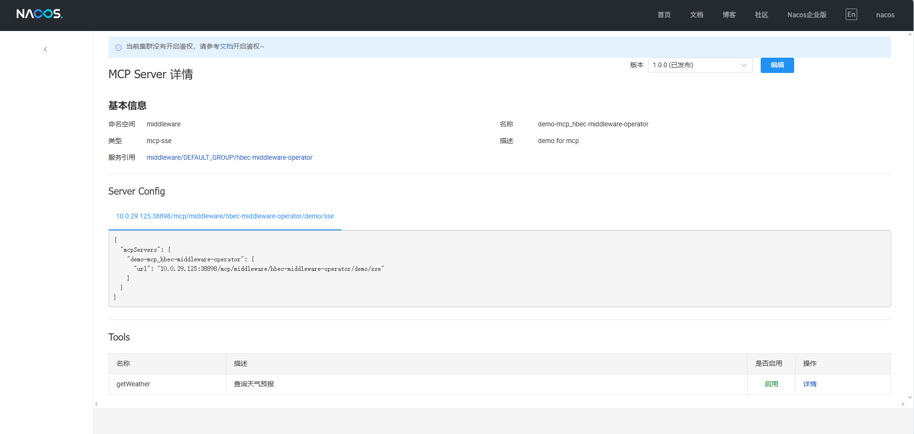
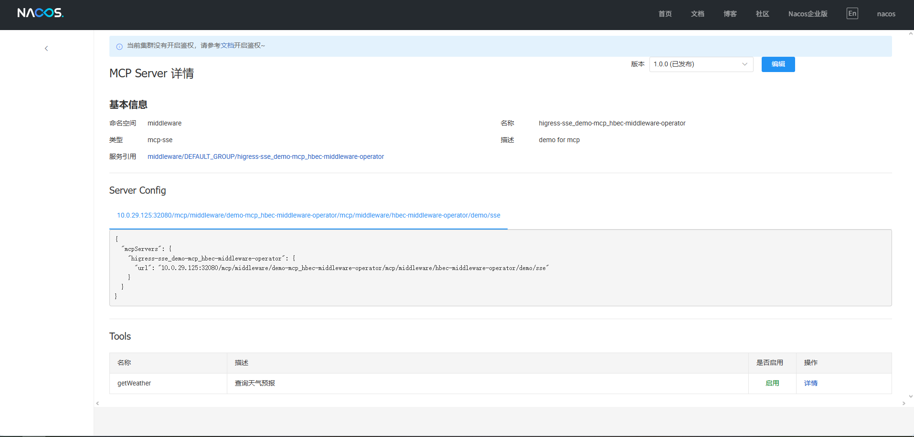
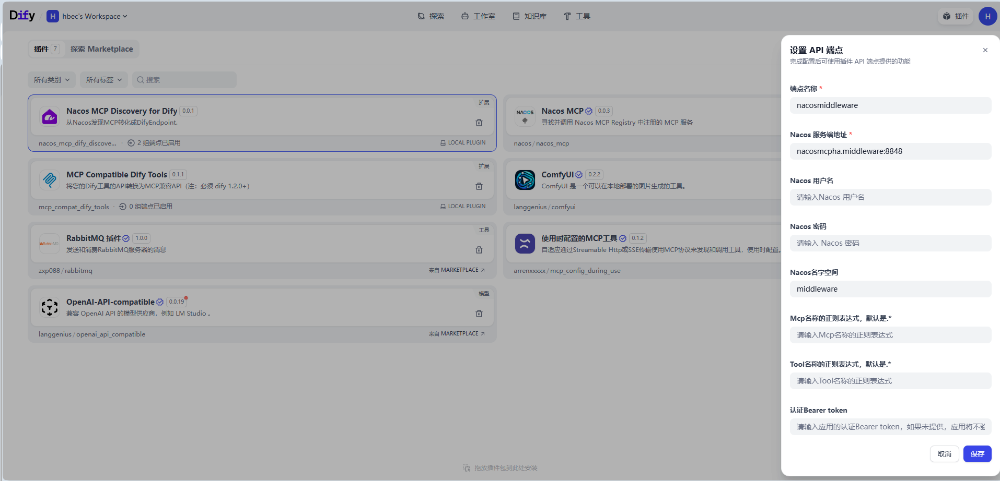
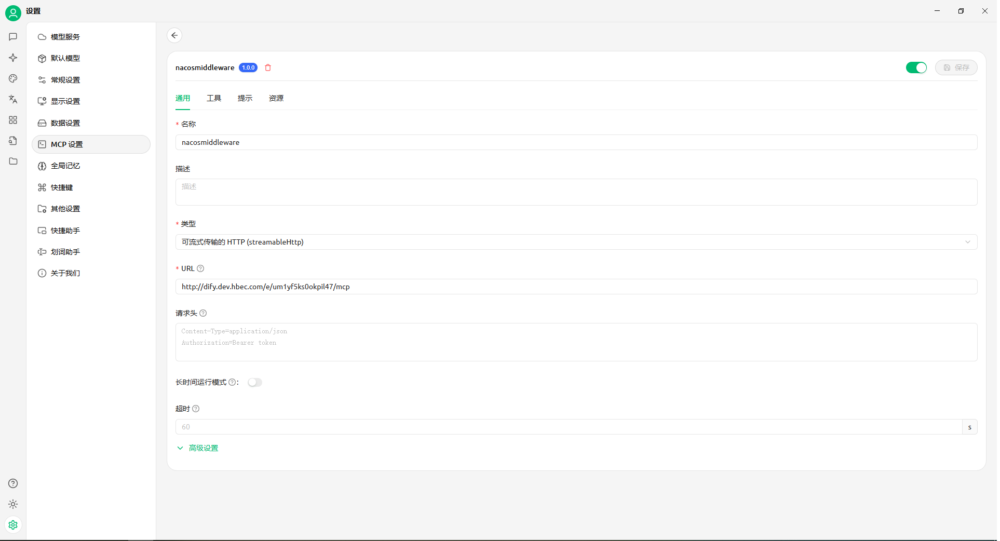
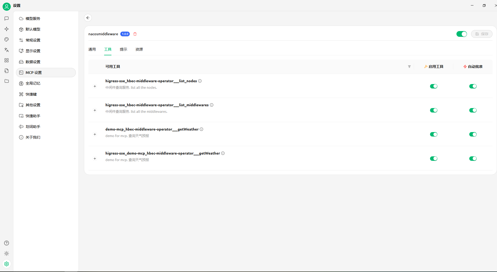

## Nacos MCP Discovery For Dify

**Author:** hbec
**Version:** 0.0.1
**Type:** Endpoint

### Description
发现 Nacos 中注册的 SSE/Streamable Http 类型 MCP Server 服务，合并所有Tool并转化为 Dify 中的Endpoint。

### Step 1 在Nacos中创建McpServer
在Nacos上创建McpServer，并添加好Tool。

### Step 2 配置Nacos
样例中会读取Nacos上的名字空间为middleware的所有Mcpserver的所有Tool，汇聚到Dify的Endpoint上。

### Step 3 配置McpEndpoint
在应用程序，比如cherrystudio上，添加上一步骤生成的Endpoint。

结果是Step2 配置条件下的所有的McpServer的所有Tool被聚合成一个Endpoint

